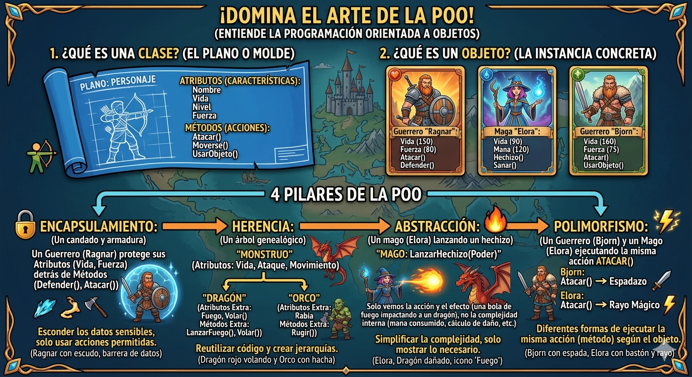
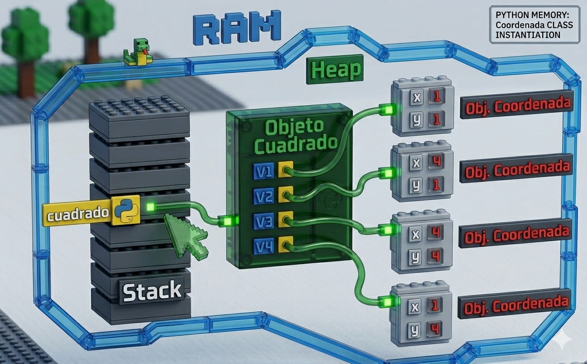

# Poo en python
Introduccion a la programacion orientada en objetos(poo) en python

## ¿Por que aprender POO?

- Imagina que quieres crear un videojuego. Tienes guerreros, magos, dragones... cada uno con sus propios puntos de vida, ataques y habilidades. ¿Como los organizo en codigo sin repetir todo una y otra vez?

- La **Programacion Orientada a Objetos (POO)** es la respuesta. En lugar de escribir instrucciones sueltas, modelas el mundo real con *objetos* que tienen caraceristicas y comportamientos. Es la forma en que estan construidos la mayoria de los programas profesionales del mundo.



## Clase y objeto

- Una clase es un tipo de dato cuyas variables se llaman objetos o instancias.

- La clase es la definicion del concepto del mundo real y los objetos o instancias son el propio "objeto" del mundo real.

- Las clases estan compuestas por dos elementos:
    - **Atributos:** informacion que almacena la clase.
    - **Metodos:** Operaciones que pueden realizarse con la clase.

## Definicion de una clase en python

``` Python
class NombreClase:
    
    def __init__(self, variable1, variable2):
        self.atributo1 = valor1
        self.atributo2 = valor2

        def nombreMetodo(self):
            BloqueCodigo
```
- `class` : palabra reservada en python para definir una clase.
- `NombreClase` : nombre de la clase que se quiere crear.
- `def` : palabra reservada en python que se utiliza para definir tanto al constructor de la clase (metodo que se ejecuta la primera vez que usas una clase) como diferentes metodos que tiene.
- `__init__`: palabra reservada en python para definir el tema constructor de la clase. El metodo `__init__` es lo primero que se ejecuta cuando creas un objeto de una clase.
- `(self, variableX)`: parámetro del constructor de la clase. El paramétro `self` es obligatorio y despues de tener tantos paramétros como quieras. La forma de añadir paramétros es la misma que en las funciones.
- `self.AtributoX`: forma de utilizacion y acceso a los atributos de la clase.
- `nombreMetodo`: nombre del metodo de la clase.
- `self`: paramétro del metodo. El paramétro `self`es obligatorio y despues puedes tener tantos paramétros como quieras. La forma de añadir paramétros es la misma que en las funciones.
- `BloqueCodigo`: instrucciones que se ejecutará el metodo.

**Al definir una clase tenga en cuenta:**
- Puedes definir tantos atributos como necesites.
- Puedes definir tantos metodos como necesites.
- Puedes definir tantos parametros en el constructor y en los metodos como necesites.

## Ejemplo 1

- Crear una clase que represente una persona.
- Atributos: nombre, apellidos y edad.
- Metodos: mostrar la informacion de la persona.

### Codigo

```Python
class Persona:

    # Metodo constructor de la clase
    def__init__(self, nombre, apellidos, edad):
        self.nombre = nombre
        self.apellidos = apellidos
        self.edad = edad

    # Metodo para mostrar la informacion 
    def mostrarPersona(self):
        print("Nombre: ", self.nombre)
        print("Apellidos : ", self.apellidos)
        prinr("Edad: ", self.edad)

def main():
    print("vamoss a aprender POO...")
    persona_1 = Persona("Lorenzo", "Perez", "18")
    persona_1.mostrarPersona() 

if __name__ == main():
    main()
```
## Representacion en RAM del objeto creado


## Composicion

- consiste en la creacion de nuevas clases a partir de otras clases ya existentes que actuan como elementos compositores de la de la nueva
- Las clases existentes seran atributos de la nueva clase.

### Ejemplo

- Una coordenada en dos dimensiones esta compuesta por dos valores, el valor en el eje x y el valor en el eje y. Esto podria ser una clase
- Un cuadrado esta compuesto por cuatro coordenadas que son los cuatro vertices. Esto podria ser una clase que esta compuesta por cuatro clases del objeto coordenada.

### Codigo Python
```Python
class coordenada:
    # Metodo constructor
    def __init__(self, x, y)
        self.X = x
        self.Y = y

    def mostrarCoordenada(self):
        print("(",self.X,",",self.Y, ")")

class cuadrado:
    # Metodo Constructor
    def __init__(self, v1, v2, v3, v4):
        print("El cuadrado esta compuesto por los siguientes vertices:")
        self.V1 = v1
        self.V2 = v2
        self.V3 = v3
        self.V4 = v4
       
     def mostrarvertices(self):
        print("El cuadrado esta compuesto por los siguientes vertices:")
        self.V1.mostrarCoordenada()
        self.V2.mostrarCoordenada()
        self.V3.mostrarCoordenada()
        self.V4.mostrarCoordenada()
       
```
## Representacion en RAM de la composicion



## Encapsulacion

- Uno de los objetivos que tiene la POO es proteger los datos de acceso o uso no contralados, y esto es lo que se conoce como **encapsulacion**
- Los datos (atributos) que componen una clase pueden ser de dos tipos:
    - **Publicos:** los datos son accesibles sin control, es decir, los datos pueden ser usados sin ningun tipo de mecanismo que protega antes usos no autorizados o indebidos.
    - **Privados:** los datos no pueden ser accedidos sin control y para acceder a ellos se debera implementar un metodo que acceda a ellos. De esta manera, los datos unicamente srean accedidos directamente por la propia clase.
- La encapsulacion tambien puede realizarse sobre los metodos.
- La definicion de atributos privados se realiza incluyendo los caracteres "__" (dos guiones de piso) entre la palabra *self* y el nombre del atributo.

### Ejemplo

### Codigo Python
```Python
class coordenada:
    # Metodo constructor
    def __init__(self, x, y)
        self.X = x
        self.Y = y

    # Metodo de acceso
    def getX(self):
        return self.__X

    def setX(self, x):
        self.__X = x

    def getY(self):
        return self.__Y
    
    def setY(self, y):
        self.__Y = y

        def mostrarCoordenadas(self):
        print("(",self.__X,",",self.__Y, ")")

## Herencia
- Permite la reutilización de código.
- Consiste en la definición de una clase utilizando como base una clase ya existente.
- La nueva clase derivada tendrá todas las caracteristicas de la clase base y ampliará el concepto de esta, es decir, tendrá todos los atributos y métodos de la clase base.
- Significa que entre dos clases existe una relación del tipo "es un".
- La herencia en Python se especifica de la siguiente manera: ```class NombreClase(ClaseBase):```
- Ejemplo:
    - Pensemos en una persona como una clase, la persona tendría una serie de atributos como pueden ser el nombre, los apellidos, la edad, etc.  Esas características de una persona serían compartidas por todas aquellas clases hijas como pueden ser alumno y profesor.  Es decir, alumno y profesor heredarían las propiedades de la clase persona y tendrían sus propias propiedades, diferentes entre ellas, como por ejemplo el curso en el que está el alumno y el horario de tutorias del profesor.

    - Clase base: Persona
        - Atributos:
            - Nombre
            - Apellidos
            - Edad

    - Clase derivada: Alumno
        - Atributos:
            - Curso
            - Asignaturas
    
    - Clase derivada: Profesor
        - Atributos:
            - Antigüedad
            - Tutorias
            - Teléfono